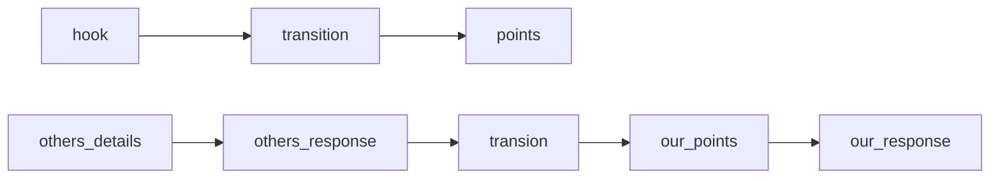
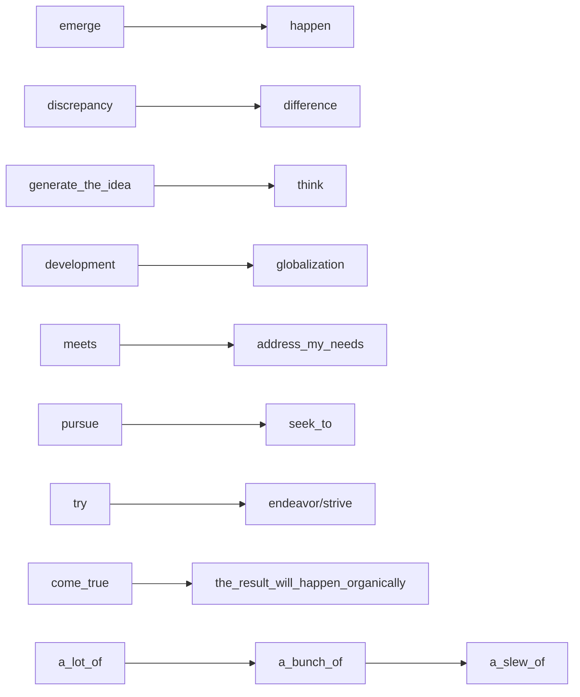

this article is about how to manage subjective part in Tofel, which means


 - integratea abc writin12333218709780-890vzd


 - independent writing

More information is below

<!--more-->


# integrated writing

the reading passage mainly discuss about that sth-------

1. However, the listening challenges the what are stated in the passage by-----
2. and the listening further demonstrate the opinion taking use of some examples.

第一段总结的时候抓最关键的--》 一般是段首的末尾或者开头

每一段都要出现听和阅读的关键词

可以不用改写


# writing methods

according to the file below:


1. 状语前置，没啥意思
2. 副词：

merely

markedly 

considerably

marginally

3. 插入语的使用：

逻辑词： 比如therefore

4. 被动

==It's imperative that + 虚拟语气==     首要的是

==5. 倒装==用了就很高级，

6. 成群的副词

intellectually and emotionally 

stably and reliably

physically and mentally 

academically and socially 

efficiently and economically

economically and socially and environmently

7. 介词短语

without exception

==in light of recent incidents,==

8. 对of的使用

- 动词和抽象名词的更换  is gradually disappearing == the gradual disappearance 
- 对形容词的更替 is of + n =adj


# independent  writing

the whole article is almost based on the following link. Inserting the photo instead of copy the characters is to forbid the audience to copy without thinking.(ahhh...that's my excuse)

https://www.bilibili.com/video/BV1UJ411T7oN?from=search&seid=1692217119371550603

## 4 situation


## core 

high level first
adequate characters


这类题型没有说必须是所有老师，可以是some of them


## grammar

连词和副词的使用：

```
-----  ,  conj-----
-----  .  adv -----
```


## beginning

==intriguing coherent clear==




impressionable（易受影响的）


### 总结:

先同意对方的观点,再反驳,提出自己的看法


## demonstrate

- **reasoning** 时的总结和结尾该怎么写 多用介词 先原因后细节
- **exemplification**   先细节后原因

exemplification:

the first sentence chose "doing" as subjection

状态，主语

example

举例子的时候一定要突出成功在什么地方，不能泛泛而谈

 

## concession&ending

concession:


however


# good expression





move up in the social hierarchy 

excessive  permissiveness 

be petrified with fear 


His success can be ascribed/attributed to his persistence and perseverance

*without which our life will*


In order to survive and thrive in this fiercely competitive society, people have no choice but to work and study hard.

*The ruthless and relentless competition imposes an unprecedented pressure on each and every individual, and there is no exaggeration that innovative and inventive ability can lay a solid foundation for our future, enabling us to survive and thrive in the fiercely competitive society.*

*I can think of no better illustration than the example of my own experience.*

I can think of no better illustration than the example of my own experience 

your dream will come true--> ==the result will happen organically==

I can think of no better illustration than the example of my own experience


start to do --> embark on 

plucky-->encouragement


because they follow their own dreams rather than being trapped by the influence of others.


the imprint of pain on the face

the recollection of his mistake and its consequence may persuade him to resist pressure to do sth.

It's acknowledged that sth embodies the spirt and essence of traditional culture, which is unequalled by any other product.

==never have there been more appropriate vehicles for direct marketing than email and Internet==       can be both used in speaking and writing 

==倒装句：==

- Important to success in learning a foreign language is constant attention to details
- not only will kids improve their cardiovascular and muscular system strength, endurance, flexibility and hand-eye cooperation, but they will also learn perseverance, goal-setting and coping skills to deal with success and failure.


raise people's welfare, reduce poverty, and foster peace and stability


set 

# practice of writing 

Nowadays, many young children may just enjoy the convenience of Internet which may mislead some of them to generate the idea that it's more important to improve the Internet access than to improve the public transportation. However, such opinion suffer from both logical and factual fallacies. And such opinion should be checked meticulously. As far as helping poor family and improve the whole society working efficiency, I strongly hold the opposite opinion that improving the public transportation matters more.

4min: 70 words:


Indeed, a voice rise that the Internet can also improve the society working efficiency, because that nowadays many IT companies take the use of Internet to start working. However, it can be not denied that not all companies are using the net work. After all, for most of companies, a more convenience transport system means more, which can reduce the economy pressure and save more time. 

我这写的都是啥啊

4min

!

# 小站公开课

注意题中有没有虚拟语气

## 段首句


assignment >= homework

homework可以有准备工作的意思,不一定是完全课后


理由三感觉就很好--> 因为两个部分有联系,就不容易单独写一个

立场句放在首段后


**注意**,  这种对比的话, even though一定是侧重点在后面而不是前面

起码这些比first second 好


==be+of+名词可以在名词之前找到合适的adj==


==三个主体段落重最能体现的放第一段==

确实,这么起的话, 第三段就有让步的意思


hardly seem on the threshold of (没有。。。门槛)


prioritize a over b


## 口语


这句话其实就是对句型的变化


话语权：

find my voice

逐渐接受：


hands-down： without doubt


cave 妥协


### 教育类话题


****


## 论证


shuttle between

奇迹--》marvel

a fever pitch

对逻辑词的运用


# 范文

## education

monotonous task

pause and ponder and some even stay solitary


shows no sign of slowing down 

fence-sitter 中立

achieve the same effect of intellectual community

while some students heap praise on its convenience, others may point out that online education is absent of teacher-student interaction, an indispensable part of learning process.  

offer an attractive alternative to someone
offer individualized instruction

in multiple format

depending on individual preferences

today's busy and fast-paced lifestyle

build schedule around particular life situation

become more diversified 


## business
launch business 

despite the benefits to students of "getting their feet wet"


AA only by exercising caution and maintaining a balanced schedule can college students ensure that any part-time job or business ventures that they undertake do not end up overtaking their academic studies.

allocate time out of class.


prior to 在--之前，可以看作介词

however, for those with a manageable schedule, exploratory mind and 


# my own accumulation of speaking 

## geography advantage 

the problem that plagued 

the study of history is the best compass we have in navigating in the future

unimpeded access to two vast ocean

what unknown lurk within them

## reality

the law of gravity still apply 

none of us will outlive our physiological term limits

combine the simplicity of conception with flexibility with application

## healthy

break out a bit zit on my face

high in fat and calories

## dance

Frequently dancers utilize objects like swords or sticks or hoops or musical instruments to further reveal information about their role in the social story portrayed in the dance

Items such as special headwear and jewelry are further examples of the garments that in general express preferences and culturally significant details about the particular culture.

## general

perform at peak productivity level

consistent action

remove ambiguity

I can be confronted with it 

eating your veggies first(先苦后甜)

gaining mental clarity

AA Not all experience and knowledge related to problem-solving can be obtained by personal effort alone due to limitations of mind and capabilities of each individual.

that's why team work in cooperation is highly emphasized in 21 st century.

Brainstorm and exchange of ideas between different thoughts never fail to enhance capabilities of each individual ==involved.==

Admittedly turning to others for help and suggestion ==by no means refers to== absolute and irresponsible dependence.

undoubtedly gives rise to better, ==if not the best== solutions

make use of all the facilities available there

make friends == get acquainted with 

sensitive to unintentional thing

nothing can make up for the opportunities that the city

create a lot of garbage that is not always disposed of properly

attend their classes to receive the maximum benefit

it may be tempting to skip them once in a while

prime alternative

adhere to the basic theory

contribute greatly to effectiveness and efficiency for a goal-accomplishment

trifles always meddle in our perfect plan, which is made in advance and try to make the most utilize of all fragment.

We will always remember the glories and hardships of yesterday, rise to the mission of today, and live up to the great dream of tomorrow.

on all fronts//  generally

experiencing our own triumphs and disasters is really the only way to learn how to deal with life.

eager to pass on their value to their children

tenacious struggle

accommodate more workers

==have a passion for==

a secular point of view

captivate the audience

uncanny knack 不可思议的技能/特别厉害的技能

boring, contrived (无聊，矫揉造作)

==in this regard==     =  in this way

sth is an abyss and sth a speck by comparison

a back-of-the-envelope calculation

exert one's power/project one's power

==be in breach of==

his thing is like an albatross a round my neck==trouble

find some ==common ground==

pragmatic, moderative, cooperative approach

==an eventuality====a possibility

yield a victory

wage competition

==pass up==  == give up 

==cutting-edge technology==   尖端科技

width== breadth

==hard-nosed== stubborn

inexorable==unstoppable

experience unprecedented sth

==whistling in the wind====in vain 

==the inescapable outcome is competition and conflict==

==the fantasy never materialized==

touch on ever dimension of

==from a realist perspective= for starters==

recipe to == a skill to 

hard to divine

turning sth into sth is a recipe to sth

self-assurance/self-esteem

enlist ally (招募盟友)

 Its work **encompasses** educational development **from** pre-school to higher education and beyond(siege)

eradicating poverty and driving sustainable development,

catalyze a global consensus on promoting universal access to education in a world of increasing complexity, uncertainty, and fragility.

intensify synergies between the members

adults are deprived of educational rights

weaves equity into all elements

 open avenues for future success.

With its profound implications on both the individual and society,

develop foundational literacy and numeracy skills as building blocks for further learning

*errant* husbands and wandering *wives*

 irrespective of  whether they happen online or not

scheduled academic breaks

To mitigate the impact of school closures

 reporting on some preliminary results of a survey

video conferencing

 need time to grow accustomed to sth

avid user of sth

social engagement（社交）

make substantive contribution to sth(实质性的贡献)

 different social strata不同阶层

 echoed by the echoed by sth 获得回应

beat sb up 击败某人

test one's agility and stamina

familiarize oneself with sth
have facility of language

be adapt at sth

lay out profusion of flowers

their indolent attitude is the cause of unnecessary pain and suffering

composed (clam)

these young ladies brought up gentility showed elegance in their behavior.

AA Being bombarded with large amount of information, people need to spend extra energy to filter through the news and capture the important information.

being distracted by the various types of news reported

unwind themselves and focus on the examinations


 In the absence of a tradition of Classical 缺少了什么if do not have sth


traditional culture：

precipitation and quintessence of culture

It embodies the best of the Chinese culture and ethos in our times and represents a new breakthrough in adapting Marxism to the Chinese context.

We must have a precise grasp of historical trends, stand firm in our ideals and convictions,

if translate literally will lose most of its poetic conjecture

subdued and somber

in piles of old paper and the long river of history

---

- China  suggest memorizing

We must have a precise grasp of historical trends, stand firm in our ideals and convictions, and stay true to our Party’s founding mission. We must remain modest and prudent, guard against arrogance and rashness, and work hard. We must not be intimidated by any risks or led astray by any distractions, and we must be absolutely certain that we make no catastrophic mistakes on fundamental issues. With the determination to never let up until we reach our goals and the attitude that the last leg of the journey marks the halfway point only, we must make unremitting efforts to advance the rejuvenation of the Chinese nation.

We must remain modest and prudent, guard against arrogance and rashness, and work hard. We must not be intimidated by any risks or led astray by any distractions, and we must be absolutely certain that we make no catastrophic mistakes on fundamental issues. 

With the determination to never let up until we reach our goals and the attitude that the last leg of the journey marks the halfway point only, we must make unremitting efforts to advance the rejuvenation of the Chinese nation.

We will always remember the glories and hardships of yesterday, rise to the mission of today, and live up to the great dream of tomorrow. We will learn from history, work hard, forge ahead for a better future, and make tireless efforts to realize the Second Centenary Goal and the Chinese Dream of national rejuvenation. 

It was unanimously agreed that the external environment has grown increasingly complex and grave over the past year under the combined impact of worldwide changes of a scale unseen in a century and the global coronavirus pandemic, while China has faced extremely arduous tasks in COVID-19 prevention and control as well as economic and social development at home.

The Political Bureau has given full consideration to both domestic and international imperatives, coordinated the COVID-19 response with economic and social development, and placed equal emphasis on development and security. It has continued to follow the general principle of pursuing progress while ensuring stability, fully applied the new development philosophy, and accelerated efforts to foster a new pattern of development. The economy has maintained good momentum, positive advances have been made in building up China’s scientific and technological self-reliance, and further progress has been achieved in reform and opening up. A complete victory has been secured in the fight against poverty as scheduled, the people’s wellbeing has been further improved, social stability has been maintained, steady progress was made in modernizing national defense and the armed forces, and China’s major-country diplomacy has advanced on all fronts. The campaign on studying the Party’s history has produced solid results, and severe natural disasters of multiple categories have been dealt with effectively. Through these efforts, significant progress has been made in all areas of the Party and country’s endeavors.

 and maintaining our vigor and vitality

represent the most magnificent chapter in the millennia-long history of the Chinese nation.

 building a moderately prosperous society in all respects// 全面建成小康社会

It has solved many tough problems that were long on the agenda but never resolved and accomplished many things that were wanted but never got done

An overwhelming victory has been achieved in the fight against corruption, and this has been consolidated across the board.


embark on the new journey to achieve the Second Centenary Goal

The cause of the Party and the country now radiates with fresh vitality

consolidate and develop political stability, unity, and dynamism.


 We have continued to develop a sound atmosphere in which people are able to live and work in peace and contentment and social stability and order prevail.

- change

With regard to eco-environmental advancement, the Central Committee has devoted greater efforts than ever before to ecological conservation and made significant progress in building a Beautiful China. Our environmental protection endeavors have seen sweeping, historic, and transformative changes.


----


sb is going to --> sb is in charge of 

AA procure the solution to solve the problem 

kindle hatred(n.) in one's heart

purge away one's sin

AA be harnessed in= be used in

 seize opportunity

tap into one's fertile imagination

==work assiduously==

focus on ==delving into==

fulfill your responsibility

your creativity and ingenuity you develop in your classes

write your destiny.

click with teacher /合拍

do not let failure define u, but let the failure teach u

get credit for doing sth. 获得名声

you become good at things through hard works.

decisions should be made as much as specificity as possible rather than on the abstract basis.

down on one's luck  水逆

paramount--override--==overarching==     首要的    the overarching question

==overall== comprehensive 


breath a sign of relief

the benefit overweigh its risk

amid the chaos


big, juicy, audacious goal

==I optimistically embrace the idea.==

lead to a spectacular failure

bracingly clear

strip into = divide into 

take the edge of (消除)

truth to be told

build up = accumulation


double-edged sword 

head bobbing up and down -> 摇摇晃晃


set attractive salaries and welfare benefits for their employees.


conducive 有利的

conducive experience


## topic的表达超重点

make new friends--> explore/expand new social networks

farm relationship


encouraging and inspiring atmosphere can be contagious 


# 独立口语/写作

45s左右

in my opinion/from my perspective, I would definitely agree with the point that .....there are several reasons    

8s


more importantly

25s


that's my opinion，thx

45s


- independent thoughts
  *writing*
  develop a critical thinking towards news.

Nowadays, with an increasingly easy access to diverse information on the Internet, people could more effortlessly collect relevant data to make informed decision when encountering previously seemingly unsurmountable difficulties

the information people received has been processed or even manipulated, causing information deemed to be insignificant by news agencies to be neglected

people could be more critical towards opinions presented by news and maintain an objective perception even after starting reading news again.

*speak*:
people could pay more attention to (news) itself instead of reading existed information.
people can stand with own opinion confirmly instead of being attracted by some rumor
so that people can maintain an objective perception
完美的开头句子

different people have different opinions.....hhh

AA


You may be prone to nervous tension 

- life style 

cure disease that can't be deal with by vaccinating. 

more healthier life

sth is important--> health is attached with great importance to people

or sth is crucial

保持体形：keep fit,

certain vitamins

students without [sufficient](http://top.zhan.com/cihui/ielts-sufficient.html) healthy food might suffer from lack of concentration on their study and they get easily distracted

people’s living standards have increased tremendously

In my opinion, being polite to others is crucial in communication.

This is primarily because being polite is a suitable and easy way to create the desired impression. Good manners cost nothing, but they can make a big difference to how other people feel about you. Politeness can make a person appear more credible because it takes a certain degree of knowledge and experience to demonstrate politeness.

In addition, being polite can often serve to avoid or minimize conflict. People with gentle manners are always aware of and respect others. Consequently, other people are more likely to be polite and courteous in return.

Finally, politeness ensures mutually satisfying interactions. When people are rude, interactions break down and end with annoyance. Politeness develops more enjoyment and satisfaction. We should always strive to be polite.

- status

So kids are in great needs of the supervision and guidance from teachers.

make substantive contribution to sth(实质性的贡献)

different social strata不同阶层

people from all walks of life

While the lack of motivation is destructive to oneself, and one will feel depressed, and have a pretty low esteem

- time 

time matters most as we all know.

We should understand that things don t always work out the way as we expect. When we make mistakes, we ought to focus on solutions, not on regrets. As the saying goes, yesterday is history, tomorrow is mystery, but today is a gift, that's why we call it present.

- culture

different culture means more opinion on the same thing. Usually we get trapped by one thing only because of restricted thought. Broaden horizon and try to solve the trouble from another side.

- Money 


- fun / exciting /relaxing /happy/comfortable  


- convenient 

relax and release my stress


- make friends 


- Improve study

Experience and knowledge borrowed or learned from others’ advice contribute greatly to effectiveness and efficiency for a goal-accomplishment

arouse/ spark my interest; arouse/ spark/ awaken/ pique my curiosity

improve study efficiency

be overwhelmed by sth

open avenues for student’s future success

develop foundational literacy and numeracy skills as building blocks for further learning

To mitigate the impact of school closures

familiarize oneself with sth
have facility of language

make a plan way in advance

> only making a plan way in advance can open the avenues for your lighting future


- Internet

too young to have any self-discipline

unwind themselves and focus on the examinations

Being bombarded with large amount of information, people need to spend extra energy to filter through the news and capture the important information.

being distracted by the various types of news reported

its advantage:

> Take myself as an example, once I turn up the computer, various types of advertisements come out, and to be honest. Some of them are attractive that I usually can't help clicking links. As a predictable result, I waste all my time on the meaningless information, which distracts me from my original aims.


> art/science
>
> Creativity
>
> u  can draw inspiration from abstract art and grand symphony.
>
>  there is no exaggeration that innovative and inventive ability can lay a solid foundation for our future, enabling us to survive and thrive in the fiercely competitive society.
>
> 17s


> supervision
>
> students are too young to have any self-discipline, and they easily get distracted by various types of news .So kids are in great needs of the supervision and guidance. Forbidding the electronic devices can make students unwind themselves and focus on the examinations.
>
> 18s
>
> internet/relax
>
> Being bombarded with large amount of information, people need to spend extra energy to filter through the news and capture the important information. Lock down the social media, leave some free time for your brain.  Being out of the useless information, you can be more aware of your goals.
>
> 18s
>
> relax
>
> Intension only make a man choose worse or make unwise decision.  I can get rid of my anxiety and release psychological pressure when I stay in a leisure environment, which can improve my study efficiency as well.     
>
> 15s
>
> habit
>
> cultivating good habits benefits a lot. Your unconscious behavior may affect your future such as a polite greeting can leave a positive impression on someone who appreciates you.    
>
> 10s
>
> different 
>
> Experience and knowledge borrowed or learned from others’ advice contribute greatly to effectiveness and efficiency. Usually we get trapped by one thing only because of restricted thought. Broaden horizon and try to treat the trouble from another side, it's time to shift your perception. 
>
> 18s
>
> save time
>
> the developed public infrastructure bring a more convenient life, which means we can choose to get anywhere by the diverse kinds of transportation. Faster speed and cheaper fee, such advantages just enhance our life equality by saving time and releasing the economy pressure. 
>
> 15s
>
> Important to success is constant attention to details.
>
> learning a skill// means you need to pay more than others,  the process of leaning can shape you the personality of persistence. For example, you need to practice the same thing over and over again to pursue perfection, which means you need to overcome the boring,repeating action and sore of your body. It will contribute a lot to your future.
>
> 18s
>
> create a process
>
> Before or after


A man survive with countless wounds or a man die with a complete body.


# my independent speaking practice

tpo 42

Intension only make a man choose worse or make unwise decision. By doing------- I can get rid of my anxiety and release pressure when I am staying in a leisure environment/we lost in euphonic sound of music, which can improve my study efficiency as well.     

Before or after watching movies, there is a lot of space to communicate, which create an opportunity to make friends. Take myself as an example,  I met my soulmate at a Film Festival organized by school. With his sharing of beauty of life, my tediously life become more vivid. 

tpo 43

Acquiring knowledge need a lot of time. If not devote your time fully like 2or3 days a week, it may seem more like a relaxation. Science like math or physics always need you to get engrossed in.

safety:

The safety will take into consideration, u need to pay attention to all means of transportation along the side towards your workspace, which will distract u from what u are doing.  


tpo44


Some people like to eat out at food stands and restaurants, while others like to prepare food at home. Often it depends on the kind of lifestyle people have. Those with very busy jobs outside the house don’t always have time to cook. They like the convenience of eating out. Overall, though, it is cheaper and healthier to eat at home. While eating in restaurants is fast, the money you spend can add up. When I have dinner at a restaurant with a friend, the bill is usually over twenty dollars. I can buy a lot of groceries with that much money. Even lunch at a fast-food stand usually costs five or six dollars for one person. That’s enough to feed the whole family at home. Eating at home is better for you, too. Meals at restaurants are often high in fat and calories, and they serve big plates of food-much more food-than you need to eat at one meal. If you cook food at home, you have more control over the ingredients. You can use margarine instead of butter on your potatoes, or not put so much cheese on top of your pizza. At home, you can control your portion size. You can serve yourself as little as you want. In a restaurant, you may eat a full plate of food "because you paid for it." It’s true that eating out is convenient. You don’t have to shop, or cook, or clean up. But real home cooking doesn’t have to take up a lot of time. There are lots of simple meals that don’t take long to make. In fact, they’re faster than eating out, especially if you think of the time you spend driving to a restaurant, parking, waiting for a table,, waiting for service, and driving home. Both eating at restaurants and cooking at home can be satisfying. Both can taste good and be enjoyed with family and friends. I prefer cooking at home because of the money and health issues, but people will make the choice that fits their


# RUSH 


## 11-13


Close examination fails to bear out the

People attend colleges or universities for a lot of different reasons. I believe that the three most common reasons are to prepare for a career, to have new experiences, and to increase their knowledge of themselves and the world around them.

 Career preparation is becoming more and more important to young people. For many, this is the primary reason to go to college, They know that the job market is competitive. At college, they can learn new skill for careers with a lot of opportunities. This means careers, such as information technology, that are expected to need a large workforce in the coming years. 

Also, students go to colleges and universities to have new experiences. This often means having the opportunity to meet people different from those in their hometowns. For most students,going to college is the first time they've been away from home by themselves. In additions, this is the first time they've had to make decisions on their own. Making these decisions increases their knowledge of themselves.

 Besides looking for self-knowledge, people also attend a university or college to expand their knowledge in subjects they find interesting. For many, this will be their last chance for a long time to learn about something that doesn't relate to their career. 

I would recommend that people not be so focused on a career. They should go to college to have new experiences and learn about themselves and the world they live in


主题句的要求 一句话之内， 结果导向句子 ，有什么好处

阐明的意思就是

论据构思的方法：

限制性条件找到


盯着绝对词

no never only any  the best 

意思就是很极端

对绝对词进行赞同或者是否定

我们的理论就没有那个限定词


没有论据马上放弃：


it's a worthy attempt for sb. to do sth

grow unsatisfied with sb  


# 作文课

没有必要对背景进行描述

重点在于逻辑

可数名词一定要认真


共鸣感     具体化     不能很笼统的概况


# My writing task 

how to read others composition 

this is a reasoning 


https://zhuanlan.zhihu.com/p/330556329


# ==My summarise==

## Topic 

when it comes to 

in handleing with new problems connected with scientific advancement 

in the extra-curricular activities 

economical 

help / contributes to 

want / intend to 

## Warrant ?

However =  In comparsion = on the contrary 

To be more specific // more specifically 

as we all know 

Since/ When/ For /As 

Impressively

The main reason is that 

Owing to

Undoubtedly 

Definetely 

In fact / In our society 

Authoritative research , most recently published, has proven that this is true 

in the name of study 

## Conclusion

they can be the great beneficiaries if they work alone

